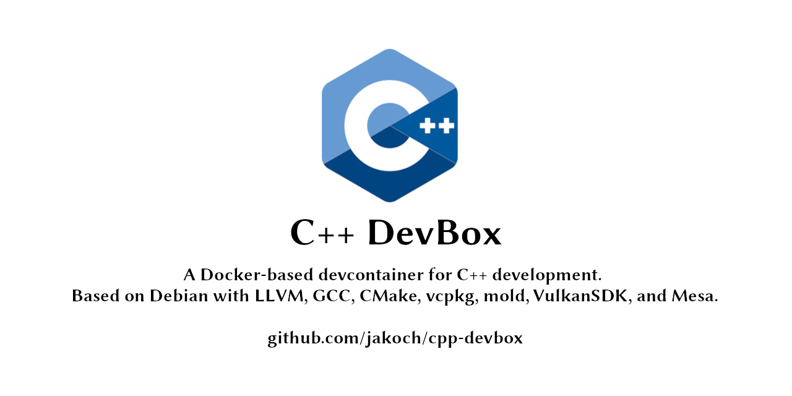

# C++ DevBox [](https://github.com/jakoch/cpp-devbox)

A Docker-based development container for C/C++ development.

**Debian Linux 12 Bookworm with LLVM 20 & GCC 12+13, VulkanSDK 1.4.304.1, Mesa, CMake, VCPKG, mold, zsh**

**Debian Linux 13 Trixie with LLVM 20 & GCC 14, VulkanSDK 1.4.304.1, Mesa, CMake, VCPKG, mold, zsh**

**Debian Linux 14 Forky with LLVM 20 & GCC 14, VulkanSDK 1.4.304.1, Mesa, CMake, VCPKG, mold, zsh**

## What is this?

This repository provides Dockerfiles for building container images based on Debian Linux.

We offer images for Debian 12 (Bookworm), Debian 13 (Trixie), and Debian 14 (Forky).

Each image is available in two variants:
- **Base:** Includes GCC and LLVM.
- **With VulkanSDK:** Includes GCC, LLVM, and additionally the Vulkan SDK with Mesa.

For a complete list of C++ related tools, see [What is pre-installed?](#what-is-pre-installed).

All images are published to the Github Container Registry (GHCR) and the Docker Hub (hub.docker.com).

The purpose of these images is to setup a C++ development environment within Visual Studio Code using a [devcontainer config](https://github.com/jakoch/cpp-devbox#fetching-the-prebuilt-container-images-using-a-devcontainer-config).

## Available Images

[bookworm-latest]: https://ghcr.io/jakoch/cpp-devbox:bookworm-latest
[trixie-latest]:   https://ghcr.io/jakoch/cpp-devbox:trixie-latest
[forky-latest]:    https://ghcr.io/jakoch/cpp-devbox:forky-latest
[bookworm-with-vulkansdk-latest]: https://ghcr.io/jakoch/cpp-devbox:bookworm-with-vulkansdk-latest
[trixie-with-vulkansdk-latest]: https://ghcr.io/jakoch/cpp-devbox:trixie-with-vulkansdk-latest
[forky-with-vulkansdk-latest]: https://ghcr.io/jakoch/cpp-devbox:forky-with-vulkansdk-latest

| ⭣ Version Tag &nbsp;&nbsp; OS ⭢  | Debian 12 - Bookworm       | Debian 13 - Trixie  | Debian 14 - Forky   |
|-----------------------------------|---------------------------|---------------------|---------------------|
| Latest | [bookworm-latest] <br>  <br>  | [trixie-latest] <br>  <br>  | [forky-latest] <br>  <br> 
| Latest "with-vulkansdk" | [bookworm-with-vulkansdk-latest] <br>  <br>  | [trixie-with-vulkansdk-latest] <br>  <br>  | [forky-with-vulkansdk-latest] <br>  <br> 

You find the [versioning scheme for images below](#versioning-scheme-for-images).

## What is pre-installed?

Here is a basic overview of the pre-installed tools. For details, please refer to the Dockerfiles.

On top of the base image the following tools are installed:

- zsh with plugins: autosuggestions, completions, history substring search
- git, nano, jq
- curl, wget
- cppcheck, valgrind
- lcov, gcov, gcovr
- strace, ltrace
- perf, gprof
- nasm, fasm
- meson
- CMake (latest version)
- ccache (latest version)
- vcpkg (latest version)
- mold (latest version)
- Doxygen (latest version)
- git, github cli

### [Dockerfile for Debian 12 - Bookworm](https://github.com/jakoch/cpp-devbox/blob/main/.devcontainer/debian/12-bookworm/Dockerfile) (oldstable)

The following C/C++ compilers and their toolchains are available:

- LLVM 20.1.0
- GCC 12.2.0
- GCC 13.4.0

### [Dockerfile for Debian 13 - Trixie](https://github.com/jakoch/cpp-devbox/blob/main/.devcontainer/debian/13-trixie/Dockerfile) (stable)

The following C/C++ compilers and their toolchains are available:

- LLVM 20.1.0
- GCC 13.3.0
- GCC 14.2.0

### [Dockerfile for Debian 14 - Forky](https://github.com/jakoch/cpp-devbox/blob/main/.devcontainer/debian/14-forky/Dockerfile) (testing)

The following C/C++ compilers and their toolchains are available:

- LLVM 20.1.0
- GCC 13.3.0
- GCC 14.2.0

### VulkanSDK

The `with-vulkansdk` image variant additionally contains:

- Vulkan SDK 1.4.321.1
- Mesa 22.3.6 (bookworm), 24.2.8 (trixie), 24.2.8 (forky)
  - (for software rendering with [LLVMpipe](https://docs.mesa3d.org/drivers/llvmpipe.html))

[What is the latest version of VulkanSDK?](https://vulkan.lunarg.com/sdk/latest.json)

## Prerequisites

You need the following things to run this:

- Docker
- Visual Studio Code

## How to run this?

There are two ways of setting the container up.

Either by building the container image locally or by fetching the prebuilt container image from a container registry.

### Building the Container Image locally using VSCode

- **Step 1.** Get the source: clone this repository using git or download the zip

- **Step 2.** In VSCode open the folder in a container (`Remote Containers: Open Folder in Container`):

   This will build the container image (`Starting Dev Container (show log): Building image..`)

   Which takes a while...

   Then, finally...

- **Step 3.**  Enjoy! :sunglasses:

### Fetching the prebuilt container images using Docker

This container image is published to the Github Container Registry (GHCR) and the Docker Hub (hub.docker.com).

You may find the Docker Hub repository here: https://hub.docker.com/r/jakoch/cpp-devbox

You may find the GHCR package here: https://github.com/jakoch/cpp-devbox/pkgs/container/cpp-devbox

In order to pull from GHCR add the prefix (`ghcr.io/`).

**Command Line**

You can install the container image from the command line:

```bash
docker pull ghcr.io/jakoch/cpp-devbox:trixie-latest
```

```bash
docker pull jakoch/cpp-devbox:trixie-latest
```

For the image containing Vulkan SDK append `with-vulkansdk-latest`:

```bash
docker pull jakoch/cpp-devbox:trixie-with-vulkansdk-latest
```

**Dockerfile**

You might also use this container image as a base image in your own `Dockerfile`:

```bash
FROM jakoch/cpp-devbox:trixie-latest
```

### Fetching the prebuilt container images using a .devcontainer config

**Devcontainer.json**

You might use this container image in the `.devcontainer/devcontainer.json` file of your project:

```json
{
  "name": "My C++ Project DevBox",
  "image": "ghcr.io/jakoch/cpp-devbox:trixie-latest"
}
```

**Devcontainer.json + with-vulkansdk image**

You might use this container image in the `.devcontainer/devcontainer.json` file of your project:

```json
{
  "name": "My C++ Project DevBox",
  "image": "ghcr.io/jakoch/cpp-devbox:trixie-with-vulkansdk-latest"
}
```

#### Developer Notes

### Versioning Scheme for Images

The container images use the following versioning scheme.

The base URL for GHCR.io is: `ghcr.io/jakoch/cpp-devbox:{tag}`.

#### Scheduled Builds

The following container tags are created for scheduled builds:

- `ghcr.io/jakoch/cpp-devbox:{debian_codename}-{date}}`
- `ghcr.io/jakoch/cpp-devbox:{debian_codename}-with-vulkansdk-{{date}}`

#### For git tag

The following container tags are created for git tags:

- `ghcr.io/jakoch/cpp-devbox:{debian_codename}-{{ version }}`
- `ghcr.io/jakoch/cpp-devbox:{debian_codename}-{{ major }}.{{ minor }}`

- `ghcr.io/jakoch/cpp-devbox:{debian_codename}-with-vulkansdk-{{ version }}`
- `ghcr.io/jakoch/cpp-devbox:{debian_codename}-with-vulkansdk-{{ major }}.{{ minor }}`

#### Latest

The container tag "latest" is applied to the latest build:

- `ghcr.io/jakoch/cpp-devbox:{debian_codename}-latest`
- `ghcr.io/jakoch/cpp-devbox:{debian_codename}-with-vulkansdk-latest`

### Field Notes for building devbox-test locally

- Before building, please remove any CMake build artifacts from the `devbox-test` directory. Otherwise, these files may be copied into the container and block a
  clean rebuild.
- To build and run `devbox-test`, use the following command (for Linux/macOS):
  ```
  docker run --rm -v "$(PWD)/devbox-test:/test-src" -w /test-src ghcr.io/jakoch/cpp-devbox:trixie-latest zsh -c "./build.sh"
  ```
- On Windows, use a relative path for the volume mount:
  ```
  docker run --rm -v ".\devbox-test:/test-src" -w /test-src ghcr.io/jakoch/cpp-devbox:trixie-latest zsh -c "./build.sh"
  ```
- This command mounts the `devbox-test` folder into the container as `/test-src`, then runs `build.sh` inside the container using `zsh`.
