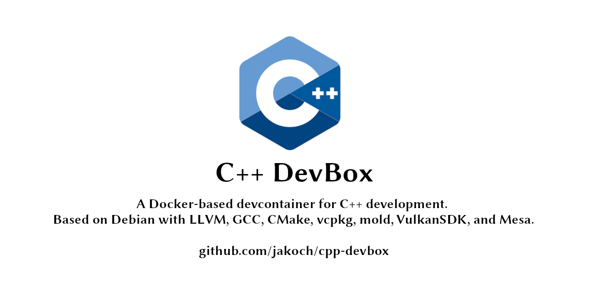

# C++ DevBox [](https://github.com/jakoch/cpp-devbox)

A Docker-based development container for C/C++ development.

It is designed especially for use with Visual Studio Code or any IDE
that supports the devcontainer standard. The images can also be used in CI workflows.

> **Quick Reference:** [Website](https://jakoch.github.io/cpp-devbox/) · [Releases & tool versions](https://jakoch.github.io/cpp-devbox/releases/) · [DockerHub](https://hub.docker.com/r/jakoch/cpp-devbox) · [GHCR](https://github.com/jakoch/cpp-devbox/pkgs/container/cpp-devbox)

## Purpose

cpp-devbox streamlines the setup of a complete C++ development stack in standardized and portable containers. It is optimized for modern C++ projects on Linux, providing compilers and tools for debugging, testing, documentation, CI.

The primary goal of these images is to enable a ready-to-use C++ development environment within Visual Studio Code using a [devcontainer configuration](https://github.com/jakoch/cpp-devbox#fetching-the-prebuilt-container-images-using-a-devcontainer-config).

## Available Images

[bookworm-latest]: https://ghcr.io/jakoch/cpp-devbox:bookworm-latest
[trixie-latest]:   https://ghcr.io/jakoch/cpp-devbox:trixie-latest
[forky-latest]:    https://ghcr.io/jakoch/cpp-devbox:forky-latest
[bookworm-with-vulkansdk-latest]: https://ghcr.io/jakoch/cpp-devbox:bookworm-with-vulkansdk-latest
[trixie-with-vulkansdk-latest]: https://ghcr.io/jakoch/cpp-devbox:trixie-with-vulkansdk-latest
[forky-with-vulkansdk-latest]: https://ghcr.io/jakoch/cpp-devbox:forky-with-vulkansdk-latest

| ⭣ Version Tag &nbsp;&nbsp; OS ⭢  | Debian 12 - Bookworm       | Debian 13 - Trixie  | Debian 14 - Forky   |
|-----------------------------------|---------------------------|---------------------|---------------------|
| Latest | [bookworm-latest] <br>  <br>  | [trixie-latest] <br>  <br>  | [forky-latest] <br>  <br> 
| Latest "with-vulkansdk" | [bookworm-with-vulkansdk-latest] <br>  <br>  | [trixie-with-vulkansdk-latest] <br>  <br>  | [forky-with-vulkansdk-latest] <br>  <br> 

Images are built on Debian Linux: **Bookworm** (12, oldstable), **Trixie** (13, stable), **Forky** (14, testing), and **SID** (unstable).

You find the [versioning scheme for images below](#versioning-scheme-for-images).

## What is pre-installed?

The image includes GCC v12–v16, Clang v16–v22 (full LLVM toolchain), CMake, Meson, Ninja, vcpkg, mold, and many more. The **with-vulkansdk** variant additionally includes the Vulkan SDK and Mesa.

See [jakoch.github.io/cpp-devbox/releases/](https://jakoch.github.io/cpp-devbox/releases/) for a detailed, version-specific breakdown of all included tools.

## Prerequisites

You need the following things to run this:

- Docker
- Visual Studio Code

## How to run this?

There are two ways of setting the container up.

Either by building the container image locally or by fetching the prebuilt container image from a container registry.

### Building the Container Image locally using VSCode

- **Step 1.** Get the source: clone this repository using git or download the zip

- **Step 2.** In VSCode open the folder in a container (`Remote Containers: Open Folder in Container`):

   This will build the container image (`Starting Dev Container (show log): Building image..`)

   Which takes a while...

   Then, finally...

- **Step 3.**  Enjoy! :sunglasses:

### Fetching the prebuilt container images using Docker

This container image is published to the Github Container Registry (GHCR) and the Docker Hub (hub.docker.com).

You may find the Docker Hub repository here: https://hub.docker.com/r/jakoch/cpp-devbox

You may find the GHCR package here: https://github.com/jakoch/cpp-devbox/pkgs/container/cpp-devbox

In order to pull from GHCR add the prefix (`ghcr.io/`).

**Command Line**

You can install the container image from the command line:

```bash
docker pull ghcr.io/jakoch/cpp-devbox:trixie-latest
```

```bash
docker pull jakoch/cpp-devbox:trixie-latest
```

For the image containing Vulkan SDK append `with-vulkansdk-latest`:

```bash
docker pull jakoch/cpp-devbox:trixie-with-vulkansdk-latest
```

**Dockerfile**

You might also use this container image as a base image in your own `Dockerfile`:

```bash
FROM jakoch/cpp-devbox:trixie-latest
```

### Fetching the prebuilt container images using a .devcontainer config

**Devcontainer.json**

You might use this container image in the `.devcontainer/devcontainer.json` file of your project:

```json
{
  "name": "My C++ Project DevBox",
  "image": "ghcr.io/jakoch/cpp-devbox:trixie-latest"
}
```

**Devcontainer.json + with-vulkansdk image**

You might use this container image in the `.devcontainer/devcontainer.json` file of your project:

```json
{
  "name": "My C++ Project DevBox",
  "image": "ghcr.io/jakoch/cpp-devbox:trixie-with-vulkansdk-latest"
}
```

### Notes for usage in CI/CD pipelines and .devcontainer configs

When using an `image_version` with a rolling tag (e.g., "trixie-latest"),
the build will always use the most recent version of that image.
As a result, included software may change over time, which can introduce
unexpected build failures (for example, due to compiler version updates).

To ensure stability and reproducibility, it is recommended to pin
`image_version` to a fixed release (e.g., "trixie-20260329") if
bleeding-edge updates are not required.

You might want to annotate your `image_version` section with the following
comment to clarify the implications of using rolling tags vs. fixed versions:

```
# Note on "image_version":
# The image versions are based on tags of the https://github.com/jakoch/cpp-devbox repo.
# Use rolling tags (e.g., "trixie-latest") for bleeding-edge updates,
# but expect potential instability due to changes in the included software.
# Pin to a fixed version (e.g., "trixie-20260329") for reproducible and stable builds.
```

#### Developer Notes

### Versioning Scheme for Images

The container images use the following versioning scheme.

The base URL for GHCR.io is: `ghcr.io/jakoch/cpp-devbox:{tag}`.

#### Scheduled Builds

The following container tags are created for scheduled builds:

- `ghcr.io/jakoch/cpp-devbox:{debian_codename}-{date}}`
- `ghcr.io/jakoch/cpp-devbox:{debian_codename}-with-vulkansdk-{{date}}`

#### For git tag

The following container tags are created for git tags:

- `ghcr.io/jakoch/cpp-devbox:{debian_codename}-{{ version }}`
- `ghcr.io/jakoch/cpp-devbox:{debian_codename}-{{ major }}.{{ minor }}`

- `ghcr.io/jakoch/cpp-devbox:{debian_codename}-with-vulkansdk-{{ version }}`
- `ghcr.io/jakoch/cpp-devbox:{debian_codename}-with-vulkansdk-{{ major }}.{{ minor }}`

#### Latest

The container tag "latest" is applied to the latest build:

- `ghcr.io/jakoch/cpp-devbox:{debian_codename}-latest`
- `ghcr.io/jakoch/cpp-devbox:{debian_codename}-with-vulkansdk-latest`

### Field Notes for building devbox-test locally

- Before building, please remove any CMake build artifacts from the `devbox-test` directory. Otherwise, these files may be copied into the container and block a
  clean rebuild.
- To build and run `devbox-test`, use the following command (for Linux/macOS):
  ```
  docker run --rm -v "$(PWD)/devbox-test:/test-src" -w /test-src ghcr.io/jakoch/cpp-devbox:trixie-latest zsh -c "./build.sh"
  ```
- On Windows, use a relative path for the volume mount:
  ```
  docker run --rm -v ".\devbox-test:/test-src" -w /test-src ghcr.io/jakoch/cpp-devbox:trixie-latest zsh -c "./build.sh"
  ```
- This command mounts the `devbox-test` folder into the container as `/test-src`, then runs `build.sh` inside the container using `zsh`.

### License

- Open Source: MIT License.
- Copyright: Jens A. Koch and contributors.

### Snappy AI-Generated Project Summary

cpp-devbox provides developers with a robust, ready-to-use C++ stack, complete with build tools, debuggers, analysis utilities, and modern graphics development support. Ideal for both local development and CI/CD pipelines.

### A Punchy One-Liner for Marketing

cpp-devbox: A ready-to-go C++ development stack for coding, debugging, and CI/CD—out of the box.

<!-- markdownlint-disable -->
<!-- Search Engine Keywords: cpp-devbox, C++ development environment, Docker container for C++, VS Code devcontainer, C++ CI/CD pipeline, modern C++ tools, cross-platform C++ build, C++ debugging tools, C++ graphics development, C++ compilers, C++ testing tools, C++ documentation tools, Linux C++ development, portable C++ environment, C++ build automation, C++ code analysis, C++ workflow, C++ IDE setup, preconfigured C++ stack, C++ software development, DevOps C++, Debian, LLVM, Clang, GCC, vcpkg, mold, VulkanSDK, Mesa  -->
<!-- markdownlint-enable -->
